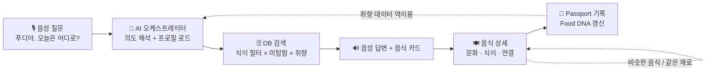

# 🎯 02 핵심 기능 · MVP 범위

> 🎯 **기획자 원칙:** 경진대회는 "기능 수"가 아니라 "하나의 경험이 끊김 없이 작동하는가"로 이긴다. 15개 기능 중 **MVP는 6개**만. 나머지는 발표에서 '확장 로드맵'으로 보여주는 것이 더 유리하다.

## MVP 핵심 루프 (이 한 바퀴가 제품이다)

## 기능 분류표

| # | 기능 | 분류 | 핵심 루프 기여 | 판단 이유 |
|---|---|---|---|---|
| 5 | 🎙 Voice AI (푸디) | **MVP** | 진입점 | 서비스 정체성. 없으면 FOODIS가 아니다 |
| 2 | 🍽 Food Explorer (음식 상세 + 연결) | **MVP** | 탐험 본체 | 음식→국가→재료→유사 음식 관계 내비게이션 |
| 4 | 🥗 Dietary Profile | **MVP** | 추천 필터 | 문제 2 해결. 구현 비용 낮고 차별화 높음 |
| 15 | 🔄 Similar Food Discovery | **MVP** | 연결 | 관계 데이터의 가시화. "그냥 검색이 아니다"를 보여주는 증거 |
| 10 | 📕 Food Passport | **MVP** | 기록 | 탐험 국가·음식 리스트 + 진행률. 리텐션 근거 |
| 3 | 🧬 Food DNA (v1: 태그 가중치) | **MVP (가벼움)** | 개인화 | 좋아요·봤어요로 맛·재료 태그 가중치 계산. 그래프 한 장으로 표현 |
| 1 | 🌎 World Food Map | 확장 1순위 | 탐험 입구 | 시각 임팩트 크지만 핵심 루프 밖. 시간 남으나 정적 SVG 지도 + 국가 탭으로 가볍게 |
| 13 | 🎧 Food Culture Radio | 확장 1순위 | 음성 콘텐츠 | TTS가 이미 있으므로 "이야기 들려줘" 인텐트만 추가하면 사실상 완성. MVP 마지막 주에 편입 검토 |
| 11 | 🍽 My Table (가상 식탁 시각화) | 확장 | 기록 시각화 | Passport의 비주얼 버전. 데이터는 같고 표현만 다름 → 나중에 |
| 8 | 🥔 Ingredient Explorer | 확장 | 연결 | 재료 페이지 = "이 재료 쓰는 음식 목록". DB 있으면 바로 구현 가능, MVP 여유 시 |
| 14 | 🗺 Food Journey / 음식 외교관 | 확장 | 스토리 | 관계 데이터의 'historical' 타입을 경로로 그리는 것. 발표에서 비전으로 제시(중국 어장(ke-tsiap) → 케첩 등 1개 예시 데이터만) |
| 6 | 📸 Food Image Recognition | 확장 | 진입점 | Vision LLM으로 바로 가능하지만 정확도 리스크가 데모를 망칠 수 있다. 시간 남으면 "사진 → 후보 3개" 형태로 |
| 9 | 🎮 Food Quest | 확장 | 리텐션 | 게이미피컬이션은 핵심 가치 증명 후 |
| 7 | 🧩 Food Knowledge Graph (시각화 UI) | 제외 (UI만) | — | 그래프 **데이터**는 MVP 핵심. 그래프 **시각화 UI**는 모바일에서 쓰기 불편. 발표 슬라이드에서만 그래프로 보여준다 |
| 12 | 🤝 World Table (커뮤니티) | 제외 | — | 사용자 없는 커뮤니티는 데모에서 빈 화면. 모데레이션 부담. 확장 로드맵에만 |

## MVP 상세 정의

### M1. Voice AI — 푸디

- 마이크 버튼 홀드 또는 탭 → STT → 텍스트 확인 표시(오인식 수정 가능) → 응답.
- 응답 = **음성(TTS) + 카드 1~3개 + 후속 추천 질문 2~3개**("문화 이야기 들려줘", "바꿔줘", "비슷한 음식").
- 텍스트 입력도 가능(음성 불가 환경 대비). 호출어 상시 감지는 제외(배터리·신뢰도 문제).
- 지원 인텐트 6개: `recommend`(추천), `explain_food`(이 음식 뭐야), `culture_story`(이야기), `filter_by_diet`(채식·할랄 등), `compare_similar`(비슷한 음식), `passport_status`(나 몇 국가 탐험했어).

### M2. Food Explorer (상세 화면)

- 음식 기본 / 문화 / 식이 / 연결 4개 섹션. 05 문서 와이어 참고.
- 연결 섹션은 반드시 탭 가능한 카드로 (국가 / 재료 / 유사 음식 / 역사적 연결).
- 하단 고정: 🎙 "푸디에게 이 음식에 대해 묻기" — 상세 화면에서도 대화 맥락 유지.

### M3. Dietary Profile

- 온보딩에서 선택: 비건 / 채식(락토오보) / 할랄 / 글루텐 프리 / 유제품 제외 / 견과류 / 갑각류 / 땅콩. 건너뛰기 가능.
- 추천 시 하드 필터(확실히 불가 음식 제외) + 상세 화면에 배지: ✅ 가능 / ⚠️ 조리법에 따라 다름 / ❓ 미확인.

### M4. Similar Food Discovery

- 관계 타입: `similar_taste`, `shares_ingredient`, `same_technique`, `historical_link`. 상세 화면 연결 섹션 + 음성 인텐트로 노출.
- 예: 만두(🇰🇷) ↔ 까일린지(🇵🇱) ↔ 라바어리(🇨🇳) ↔ 코국스(🇩🇪) — "만두 로드".

### M5. Food Passport

- 탐험한 국가 수 / 음식 수 / 국기 그리드. "봤어요(탐험)" · "먹어봤어요" · "좋아요" · "저장" 4개 액션.
- 상세 화면 진입만으로 '탐험' 자동 기록.

### M6. Food DNA v1

- 좋아요·먹어봤어요 음식의 맛 태그(매움/발효/국물/고기/해산물/단맛/향신료…) 가중 합산 → 레이더 차트 1개 + 한 줄 요약("발효·매움맛·국물 태그가 강합니다").
- 추천 시 사용자 벡터 → 음식 태그 벡터 유사도 + 미탐험 국가 가산점.

## 제외·연기 기능 공통 사유

- 데모 한 번에 보여줄 수 있는 것은 5분이다. 핵심 루프 밖의 기능은 데모에 나오지 않고, 나오지 않는 기능은 점수가 아니라 버그 리스크다.
- 데이터 입력 시간이 개발 시간과 경쟁한다. 기능을 줄여 데이터 품질에 시간을 쓴다.

## MVP 개발 주차 목표 (참고)

| 주 | 목표 | 완료 기준 |
|---|---|---|
| W1 | DB 스키마 + 시드 30건 + 상세 화면 정적 | 음식 1개를 상세 화면에서 연결 탭으로 돌 수 있다 |
| W2 | 텍스트 기반 AI 추천(RAG) + 답변 스키마 → 카드 | 텍스트로 물으면 DB 기반 카드가 뜨고 출처가 표시된다 |
| W3 | STT/TTS 연결 + Dietary Profile + Passport | 음성으로 핵심 루프가 한 바퀴 돈다 |
| W4 | 데이터 150건 채움 + 첫 화면 연출 + Food DNA + 안정화 | 데모 시나리오 3회 연속 성공 |
