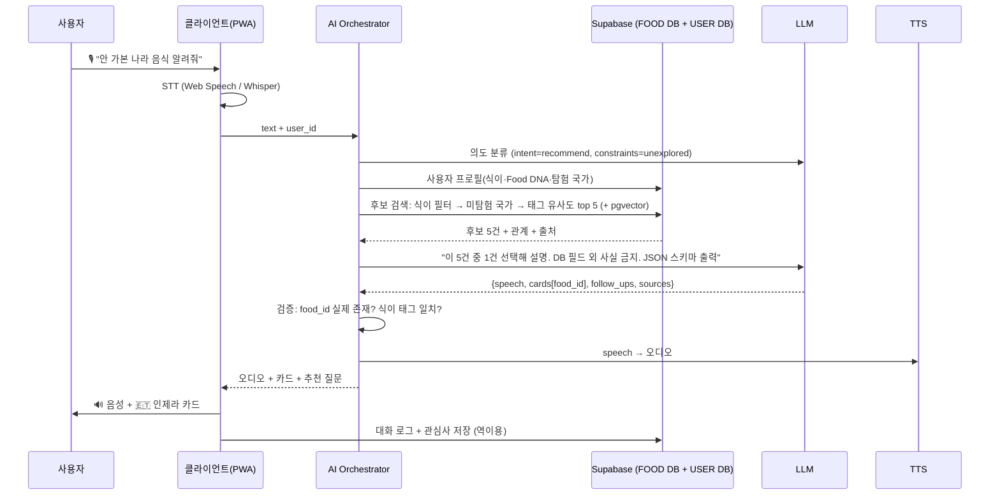

# 🎙️ 03 사용자 시나리오 · 음성 대화 설계

> 🎙️ 이 문서의 스크립트가 **DB 커버리지, 프롬프트, 데모의 기준점**이다. 여기 있는 질문은 반드시 동작해야 하고, 데이터도 이 질문에 답할 수 있게 채워진다.

## 1. 이용 시나리오

### 시나리오 A — 탐험가 민준: "오늘은 어디로?"

1. 점심 전, 앱 실행. 국기가 모여 FOOD가 되는 인트로(첫 실행만, 3초).
2. 메인 화면 중앙 🎙 탭. "푸디야, 내가 안 가본 나라 음식 하나 알려줘."
3. 푸디: 음성 답변 + 🇪🇹 인제라 카드. 추천 질문: [문화 이야기] [비슷한 음식] [다른 거 추천].
4. 카드 탭 → 상세 화면. 문화 섹션에서 "손으로 뜯어 나눠 먹는다" 읽고, 연결 섹션에서 테프 → 사워도우 카드 탭.
5. Passport에 에티오피아 자동 기록. "12개국 탐험" 토스트.
6. 일주일 후 같은 질문 → 다른 답(에티오피아는 미탐험에서 제외됨).

### 시나리오 B — 비건 아이사: "인도 음식 중에 뭐 먹을 수 있어?"

1. 온보딩에서 비건 설정. 이후 매번 말할 필요 없음.
2. "푸디야, 인도 음식 추천해줘."
3. 푸디: 차나 마사라(✅ 비건), 알루 고비(✅) 추천. 팔락 파니어는 추천 안 됨(✕ 유제품). "버터 치킨은 비건이 아니에요" 같이 먼저 말하지 않고, 맞는 것만 말한다.
4. 상세 화면 식이 섹션: "⚠️ 기(ghee) 사용 식당 있음 — 주문 시 확인" 표기. 정직한 불확실성 표기가 핵심.

### 시나리오 C — 문화 학습자 세빈: "이야기 하나 들려줘"

1. 출근길, 이어폰. "푸디야, 음식 문화 이야기 하나 들려줘."
2. 푸디: 터키 커피와 유럽 카페 문화의 연결 이야기 60사민(DB culture_story 필드 기반, 연결 데이터로 마무리).
3. "오스트리아 카페 문화도 이야기해줘" → 맥락 유지 대화.
4. 화면은 안 봐도 된다. 이것이 Voice First의 증명.

## 2. AI 동작 시나리오 (추천 인텐트 예)

**핵심:** LLM은 "선택·설명·연결"만 한다. 후보는 DB가 고르고, 출력은 스키마로 제한되고, food_id는 서버가 검증한다.

## 3. 음성 대화 스크립트 (데모 필수 10개)

| # | 사용자 발화 | 인텐트 | 푸디 음성 답변 (예) | 화면 카드 |
|---|---|---|---|---|
| 1 | 푸디야, 오늘은 어디로 떠나볼까? | recommend | 오늘은 페루로 가볼까요? 세비처는 신선한 생선을 라임에 재운 음식인데, 일본 이민자의 영향으로 태어났어요. 평소 해산물을 좋아하셔서 골랐어요. | 🇵🇪 세비처 · [문화 이야기] [비슷한 음식] [다른 거] |
| 2 | 내가 아직 안 가본 나라 음식 알려줘 | recommend(unexplored) | 에티오피아는 아직 안 가보셨네요. 인제라는 테프라는 곡식을 발효시켜 만든 시머열한 발효빵이에요. 좋아하시는 발효 음식과 이어지죠. | 🇪🇹 인제라 |
| 3 | 나 채식주의자인데 인도 음식 추천해줘 | filter_by_diet + recommend | 채식 기준으로 차나 마사라를 골랐어요. 북인도의 병아리콩 요리로, 채식 인구가 많은 인도에서 일상 음식이에요. 기(ghee)를 쓰는 식당도 있어서 비건이시면 확인이 필요해요. | 🇮🇳 차나 마사라 · ✅ 채식 ⚠️ 비건 확인 |
| 4 | 이 음식 어느 나라 음식이야? (화면에 카드 있을 때) | explain_food(context) | 지금 보고 있는 팔라펠은 중동 전반에서 먹는 음식이에요. 기원은 이집트라는 설이 유력하지만 레바논·이스라엘 등 여러 지역이 자국 음식으로 여기고 있어요. | 🇪🇬🇱🇧 팔라펠 · 관련 국가 카드 |
| 5 | 음식 문화 이야기 하나 들려줘 | culture_story | (60초) 터키 커피 이야기 — 오스마에서 비엔나 카페로 연결. 마무리: "비엔나 카페 문화도 이어서 들려드릴까요?" | 🇹🇷 터키 커피 · [이어서 듣기 🇦🇹] |
| 6 | 비슷한 음식 있어? | compare_similar(context) | 만두와 비슷한 음식은 세계 곳곳에 있어요. 폴란드 피에로기, 조지아 힌칼리, 네팔 모모. 밀가루 반죽에 소를 싸서 익히는 것은 같고, 소와 소스가 다르죠. | 🇵🇱 🇬🇪 🇳🇵 카드 3개 |
| 7 | 나 몇 국가 탐험했어? | passport_status | 지금까지 12개국, 27개 음식을 탐험하셨어요. 아시아가 많고 아프리카는 아직 한 국가예요. 다음엔 아프리카로 가볼까요? | Passport 요약 카드 · [아프리카 추천] |
| 8 | 할랄 음식만 보여줘 | filter_by_diet | 할랄 기준으로 확인된 음식만 골랐어요. 조리 방식에 따라 다른 음식은 노란 표시를 두었으니 식당에서 확인해 주세요. | 카드 3개 + 배지 |
| 9 | 푸디야, 김치의 기원 알려줘 (DB에 여러 설이 있는 것) | explain_food | 김치는 삼국시대 절임 기록이 있고, 고추가 들어간 것은 18세기 이후라고 알려져 있어요. 정확한 시점은 학자마다 조금 다르고요. | 🇰🇷 김치 · 출처 표시 |
| 10 | 푸디야, 화성 음식 추천해줘 (DB에 없는 것 / 무의미 질문) | out_of_scope | 그건 제가 가진 음식 지도에는 없네요. 대신 지구에서 가장 먼 고지대 음식은 어떠세요? 볼리비아의 살테나스라는 게 있어요. | 🇧🇴 살테나스 |

## 4. AI 답변 UX 규칙

| 규칙 | 이유 |
|---|---|
| 음성 답변은 **2~3문장, 15초 이내** (culture_story만 60초 허용) | 긴 음성은 끊기게 된다. 상세는 카드가 맡는다 |
| 구조: **제안 → 한 줄 설명 → 개인화 이유 → (문화 한 조거리)** | "왜 나에게 이걸 추천했나"가 들어가야 AI 개인화가 체감된다 |
| 카드는 **1~3개**, 그 이상은 "더 보기" | 선택 피로 방지 |
| 추천 질문 버튼 **2~3개** 강제 (다음 탐험 링크) | 막다른 답변 금지 원칙 |
| 식이 정보는 **DB 값 그대로**, 불확실하면 "확인 필요"라고 말한다 | 안전 + 신뢰. 경진대회 Q&A에서 가장 강한 답 |
| 출처는 카드 하단에 작게, 음성에서는 읽지 않는다 | 음성 흐름 유지, 검증 가능성 확보 |
| STT 인식 텍스트를 화면에 표시, 탭해서 수정 가능 | 오인식 리카버리. 데모 안정성 |
| 응답 대기 중 "푸디가 지도를 보고 있어요…" 상태 표시 + 음성 스트림 첫 문장 우선 재생 | 체감 지연 감소 (목표 3초 내 첫 음성) |

## 5. 푸디 페르소나 (프롬프트 톤 가이드)

- 호기심 많은 여행 동반자. 가이드가 아니라 함께 탐험하는 친구.
- 해요체, 가벼운 경어. 이모지 음성 텍스트에 금지.
- 모르면 모른다고 한다. 단, 항상 대안을 제안한다.
- 비교·국가 우열 표현 금지 ("더 맛있다", "문화가 뛰어나다"). 문화 존중이 브랜드 가치.
