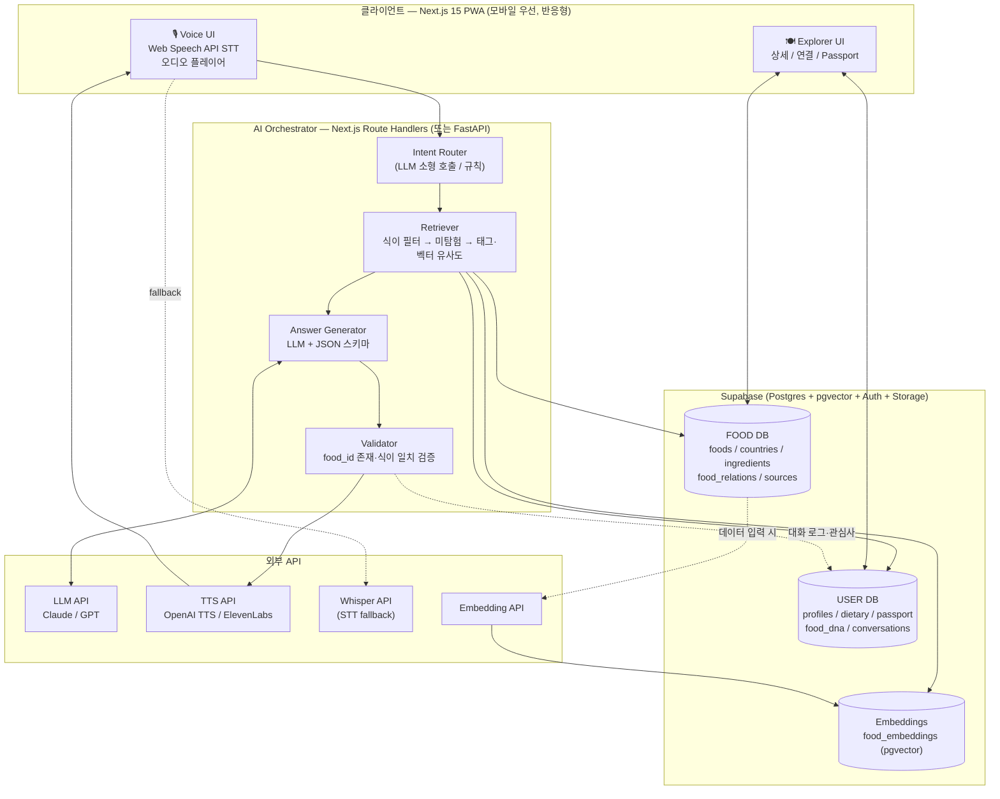

# 🧠 04 데이터 · AI/RAG · 시스템 아키텍처

> 🧠 **원칙: DB가 사실의 기준, AI는 그 위에서 설명·연결·개인화한다.** 기술 구현 수준 30점은 이 문서에서 나온다. 각 기술 선택에 "어떤 사용자 문제를 푸는가"를 붙였다.

## 1. 전체 시스템 아키텍처



## 2. 기술 스택 선정 및 근거

| 영역 | 선택 | 해결하는 사용자 문제 | 대안 / 버린 이유 |
|---|---|---|---|
| 프론트 | **Next.js 15 (App Router) + PWA + Tailwind + Framer Motion** | 스마트폰 하나로 설치 없이 사용. 팀 숙련도 최고 → 완성도 확보 | React Native: 개발 기간 초과, 스토어 심사 불필요 |
| 백엔드 | **Next.js Route Handlers** (AI 로직 무거워지면 FastAPI 분리) | 단일 배포, 지연 최소화 | Python 파이프라인이 다양해지면 FastAPI로 |
| DB | **Supabase (Postgres + pgvector + Auth + Storage)** | 관계형 음식 데이터 + 벡터 검색 + 사용자 인증을 한 곳에서 | Neo4j(그래프 DB): 관계 300건 수준은 Postgres 조인으로 충분. Pinecone: 벡터 200건에 별도 인프라 불필요 |
| LLM | **Claude Sonnet 또는 GPT-4o 계열 (JSON 스키마 출력 지원)** | 자연어 질문 해석 + 개인화 설명 생성 | 오픈소스 자체 호스팅: 한국어 품질·지연·운영 부담. 발표 "AI/라이브러리 사용 설명"에서 역할 범위를 밝힐 것 |
| Embedding | **text-embedding-3-small** (다국어 지원) | "살음하게 삭히는 고기 요리" 같은 모호한 표현을 음식과 매칭 | 키워드만: 음성 질문은 키워드가 없는 게 본질 |
| STT | **Web Speech API (무료·저지연) + Whisper API fallback** | 최대한 빠르게 한국어 인식. 데모 환경 브라우저 제약 대비 | iOS Safari에서 Web Speech 불안정 → fallback 필수 |
| TTS | **OpenAI TTS (기본) / ElevenLabs (품질 우선 시) / 브라우저 speechSynthesis (오프라인 fallback)** | 자연스러운 한국어 음성이 "푸디"의 정체성 | 스트리밍 지원 여부로 최종 선택 (P3에서 측정) |
| 지도 (확장) | react-simple-maps (정적 SVG) | 국가 단위 탐험 입구 | Mapbox/Google: 유료·과한 기능. 국가 선택만 필요 |
| 이미지 인식 (확장) | Vision LLM → 후보 3개 → DB 매칭 | "이거 뭐야?" 진입점 | 자체 분류 모델: 데이터 부족 |

## 3. DB 스키마

### FOOD DB (사실 영역 — 사람이 검수)

```sql
-- 국가
countries (
  id text pk,                -- ISO 3166-1 alpha-2 (KR, ET, PE ...)
  name_ko text, name_en text,
  region text,               -- East Asia / Horn of Africa ...
  flag_emoji text,
  accent_color text,         -- 국가 Accent 컬러 (hex)
  culture_summary text,      -- 식문화 개요 2~3문장
  dining_style text          -- 식사 방식
)

-- 음식
foods (
  id uuid pk,
  slug text unique,
  name_ko text, name_en text, name_local text,
  country_id text fk -> countries,
  region_in_country text,
  summary text,              -- 1~2문장 (음성 답변용)
  history text,              -- 역사
  culture_story text,        -- 문화적 의미 · 언제 먹는가 · 어떻게 먹는가 (Radio용 60초)
  cooking_method text,       -- fermented / grilled / steamed / stewed / raw / fried / baked
  taste_tags text[],         -- spicy, fermented, soupy, sweet, umami, herbal, sour, smoky ...
  course_type text,          -- main / side / street / dessert / drink
  image_url text,
  diet_vegan diet_level,     -- yes / depends / no / unknown
  diet_vegetarian diet_level,
  diet_halal diet_level,
  diet_gluten_free diet_level,
  diet_dairy_free diet_level,
  allergens text[],          -- nuts, shellfish, peanut, egg, soy, wheat, dairy, fish, sesame
  diet_note text,            -- "기(ghee) 사용 식당 있음"
  verified boolean default false,
  created_at timestamptz
)

-- 재료
ingredients ( id uuid pk, name_ko, name_en, category text, origin_region text )
food_ingredients ( food_id fk, ingredient_id fk, role text )   -- main / seasoning / optional

-- 음식 간 관계 (지식 그래프의 엣지)
food_relations (
  id uuid pk,
  from_food_id fk, to_food_id fk,
  relation_type text,        -- similar_taste / shares_ingredient / same_technique / historical_link / regional_variant
  description text,          -- "밀가루 반죽에 소를 싸서 익히는 조리법 공유"
  strength smallint          -- 1~5
)

-- 출처
sources ( id uuid pk, food_id fk, field text, url text, title text, source_type text, accessed_at date )

-- 임베딩
food_embeddings ( food_id fk pk, embedding vector(1536), text_used text )
```

### USER DB (역이용 영역)

```sql
profiles ( user_id uuid pk fk -> auth.users, display_name, locale, created_at )
dietary_profiles ( user_id fk, vegan bool, vegetarian bool, halal bool, gluten_free bool, dairy_free bool, allergens text[] )
passport_entries ( user_id fk, food_id fk, status text, created_at )   -- explored / tried / liked / saved
food_dna ( user_id fk pk, tag_weights jsonb, updated_at )               -- {"spicy":0.8,"fermented":0.7,...}
conversations ( id, user_id, intent, user_text, ai_json jsonb, food_ids uuid[], created_at )
```
**역이용 경로:** passport_entries(liked/tried) + conversations(food_ids) → 배치로 food_dna.tag_weights 갱신 → 다음 추천의 Retriever 입력. 데이터가 쌓일수록 추천이 정교해진다.

## 4. RAG 파이프라인 (추천 인텐트 기준)

| 단계 | 처리 | 구현 |
|---|---|---|
| ① Intent | 발화 → 인텐트 6종 + 슬롯(국가, 식이, 문맥 food_id) | LLM 소형 호출 (JSON). 문맥 food_id는 클라이언트가 함께 전송 |
| ② Hard Filter | 식이 프로필 기반 WHERE (예: vegan → diet_vegan IN ('yes','depends')) | SQL. **LLM이 아니라 DB가 거른다** |
| ③ Unexplored | passport에 있는 국가·음식 제외 (또는 가산점) | SQL NOT IN / 스코어 +0.3 |
| ④ Hybrid Retrieval | (a) 발화 임베딩 ↔ food_embeddings 코사인 (b) food_dna.tag_weights ↔ taste_tags 내적 (c) 국가 슬롯 일치 | pgvector `<=>` + 가중합. Top 5 |
| ⑤ Context 조립 | Top 5의 summary / culture_story / diet / relations / sources를 구조화 컨텍스트로 | 토큰 제한: 음식당 ~300 토큰 |
| ⑥ Generate | "이 후보 중 1개 선택, 사용자 취향 연결해 2~3문장 음성문 작성. 컨텍스트 외 사실 금지" | JSON 스키마 강제: {speech, cards[{food_id, badges}], follow_ups[], sources[]} |
| ⑦ Validate | food_id가 후보 내에 있는가 / 식이 배지가 DB 값과 일치하는가 / speech에 후보 없는 음식명 등장하는가 | 실패 시 1회 재생성, 재실패 시 템플릿 답변("이 음식은 어떠세요?" + 카드만) |
| ⑧ Speak + Log | TTS 스트림, conversations 저장, passport explored 기록 | 첫 문장 우선 합성해 체감 지연 감소 |

## 5. 할루시네이션 방지 — 5감의 방어

1. **후보 폐쇄성** — LLM은 DB가 건네주지 않은 음식을 언급할 수 없다. food_id 검증으로 강제.
2. **식이 정보 생성 금지** — ✅⚠️❓ 배지는 LLM 출력이 아니라 DB 커럼을 서버가 그린다. LLM은 문장에서 이를 "해설"할 뿐.
3. **정직한 불확실성** — diet_level 'unknown'이면 "확인 필요"로 말한다. 낮은 유사도(threshold 미달)면 "제 지도에는 없어요" + 대안.
4. **출처 표기** — 모든 카드에 sources 링크. 필드별 출처로 "어떤 주장이 어디서 왔나" 검증 가능.
5. **데이터 검수 프로세스** — LLM 초안 작성 허용, 단 verified=true는 사람이 출처 확인 후에만. 식이 커럼은 검수 전 'unknown' 고정. 미검수 데이터는 추천 후보에서 제외.
**경진대회 Q&A 답변 버전:** "저희 AI는 음식을 발명할 수 없습니다. DB가 골라준 후보 안에서 고르고 설명만 하며, 서버가 답변 안의 음식 ID와 식이 정보를 DB와 대조해 검증합니다. 할랄·알레르기 배지는 AI가 아니라 DB 값에서 그립니다."

## 6. 데이터 구축 계획

- **범위 (2026-10-01 확장):** 지도는 **130개국** (아시아 27, 유럽 37, 중동·아프리카 36, 아메리카 24, 오세아니아 6). 심화 30개국 × 6 음식 + 확장 100개국 × 대표 음식 1 = 280건. 음식이 아직 없는 나라는 국가 페이지에서 가까운 나라 음식으로 잇고, 푸디는 "아직 검수 중"이라고 말한다. 국가당 채식 가능 음식 최소 1개, 할랄 가능 1개 포함(시나리오 B 보장).
- **관계:** 300건 이상. "만두 로드", "발효 음식", "납작빵 로드", "실크로드 향신료" 등 테마 클러스터 중심으로 채운다.
- **파이프라인:** 국가·음식 리스트 확정 → LLM으로 필드 초안 CSV 생성 → 팀원이 출처(위키백과, 국가 관광청, 음식 문화 문헌) 확인 후 verified → Supabase import → 임베딩 배치.
- **출처 우선순위:** 공식 관광·문화 기관 > 학술·백과 > 일반 음식 매체. 식이 정보는 최소 2개 출처 일치 시에만 'yes/no'.

## 7. 다국어

- MVP는 한국어 UI + 음식명 ko/en/local 3개 커럼. 영어 UI는 i18n 키만 분리해 두고 확장으로.
