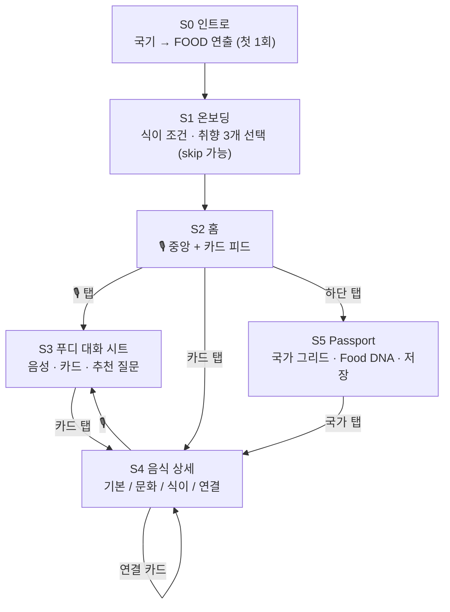

# 🎨 05 화면 구조 · UX Flow · 디자인 시스템

> 🎨 모바일 우선, 한 손 조작. 화면은 5개만. 모든 화면 하단에 🎙 푸디 버튼이 고정되어 어디서든 대화로 돌아온다.

## 1. 스크린 맵



## 2. S0 인트로 연출 (브랜드 핵심)

| 시간 | 연출 | 구현 방안 |
|---|---|---|
| 0.0~1.2s | Warm White 배경. 국기 이모지 20~25개가 화면 가장자리에서 들어와 부드럽게 흔들림(바람) | Framer Motion, 개별 랜덤 경로 + sin 진동. 국기 이모지 또는 소형 SVG |
| 1.2~2.2s | 국기들이 중앙으로 수렴. 가까워질수록 축소·블러 | 목표 좌표 = "FOOD" 글자 위 샘플 포인트 (canvas getImageData로 글자 마스크 샘플링) |
| 2.2~2.8s | 국기가 글자 형태로 녹아들고 **FOOD** 워드마크(Deep Green)가 나타남 | opacity crossfade |
| 2.8~3.2s | "Different Cultures, One Table." → [세계 음식 탐험하기] 버튼 fade-in | 총 3.2초. 우상단 "건너뛰기". 첫 1회만, 이후 1초 단축버전 |

**예산 부족 시 fallback:** 국기가 원형으로 모여 중앙 점으로 수렴 → 점에서 FOOD가 퍼지는 버전. 의미는 같고 구현은 반나절.

## 3. S2 홈 와이어 구조

```
┌─────────────────────────────────┐
│ FOOD                        📕 12국가 │  ← 로고 + Passport 축약
│                                     │
│   🌎 오늘은 어디로 떠나볼까요?        │  ← H1
│                                     │
│            ╭───────╮                │
│            │  🎙   │                │  ← 대형 음성 버튼 (Soft Mint, pulse)
│            ╰───────╯                │
│     "푸디야, 무엇이든 물어보세요"      │  ← 힐트 + 텍스트 입력 토글(작게)
│                                     │
│  ── 오늘의 탐험 ─────────────────────   │
│  ┌────────────────────────────┐    │
│  │ 🇪🇹 인제라          [▶ 듣기] │    │  ← 국가 Accent 컬러 이미지 카드
│  │ 테프를 발효시켜 만든 시머열한 빵    │    │
│  └────────────────────────────┘    │
│  ── 나를 위한 추천 ───────────────────  │
│  [🇵🇪 세비처] [🇹🇷 메네멘] [🇿🇦 보보티] → │  ← 가로 스크롤 소형 카드
│  ── 최근 탐험 ───────────────────────   │
│  [🇰🇷 김치] [🇮🇳 차나 마사라]        │
├─────────────────────────────────┤
│   🌎 홈     🎙 푸디     📕 Passport   │  ← 탭 바 3개
└─────────────────────────────────┘
```

## 4. S3 푸디 대화 시트

- 하단에서 올라오는 바텀 시트(홈/상세 위에 겹쳐짐 → 맥락 유지).
- 상단: 인식된 사용자 발화 텍스트 (탭해 수정). 중앙: 푸디 음성 파형 애니미이션 + 자막. 하단: 카드 1~3개 가로 스냅 + 추천 질문 캡슐 2~3개 + 🎙 재질문.
- 대화 히스토리는 위로 스크롤. 쳇 UI가 아니라 "말하는 카드 피드" 느낌.

## 5. S4 음식 상세

```
[이미지 헤더 — 국가 Accent 그라데이션 오버레이]
🇪🇹 에티오피아 · 전국
인제라  Injera  እንጀራ
[✅ 비건] [✅ 할랄] [⚠️ 글루텐: 테프는 GF, 밀 혼합 식당 있음]      ← 식이 배지 (DB 값)

탭: [기본] [문화] [식이] [연결]
── 기본: 요약 · 주요 재료 칩(테프, 물) · 조리법(발효→부침) · 맛 태그
── 문화: 역사 · 언제 먹나 · 어떻게 먹나(손으로, 구르샤) · [▶ 푸디가 이야기로 들려주기]
── 식이: 비건/채식/할랄/GF/유제품 표 · 알레르기 · 주의 노트 · 출처
── 연결: 
     같은 재료    [🇮🇳 도사] 
     비슷한 음식  [🇮🇳 도사] [🇫🇷 크레프] [🇲🇽 토르티야]   ← relation_type별 행
     같은 나라    [🇪🇹 도로 와트] [🇪🇹 시로]
     역사적 연결  [🇪🇷 마사후프 (에리트레아 변이)]

[📕 먹어봤어요] [❤️ 좋아요] [🔖 저장]              [🎙 푸디에게 묻기]
```

## 6. S5 Passport

- 상단 요약: "12개국 · 27개 음식 탐험". 세계 대륙 바 채움율.
- 국기 그리드: 탐험 국가 컨러, 미탐험 회색. 탭 → 해당 국가 음식 리스트.
- Food DNA 레이더 차트 1개 + 한 줄 요약. 저장·좋아요 음식 리스트.
- 하단 CTA: "푸디야, 다음은 어디로?" (🎙)

## 7. 디자인 시스템

### 컬러

| 토큰 | 값 | 용도 |
|---|---|---|
| `--mint-500` Soft Mint | #7FD1AE | 음성 버튼, 주요 액션, 활성 탭 |
| `--mint-100` | #E6F7EF | 커스텀 칩 배경, 세션 구분 |
| `--green-800` Deep Green | #1F5F46 | 워드마크, 강조 텍스트, 링크 |
| `--ivory` Warm White | #FBF8F1 | 기본 배경 |
| `--surface` | #FFFFFF | 카드 |
| `--charcoal` Dark Charcoal | #2B2B2B | 본문 텍스트 |
| `--muted` | #7A7A72 | 보조 텍스트, 출처 |
| `--diet-ok / warn / unknown` | #2E9E6B / #E0A526 / #9CA3AF | 식이 배지 3단계 |
| `--accent-{country}` | countries.accent_color | 음식 카드 헤더 그라데이션, 국가 칩. 국기 주색에서 채도 낮춰 사용 |

**"비건·건강식으로 보이지 않게" 하는 방법:** 민트는 UI 크롬(버튼·탭)에만, 콘텐츠 영역은 음식 사진과 국가 Accent가 지배. 싱그러운 워드마크 세리프로 "여행·문화" 느낌을 더한다.

### 타이포그래피

- 워드마크·H1: **Fraunces** 또는 **Playfair Display** (세리프, 여행·문화 톤)
- 본문: **Pretendard** (한글 가독성), 영문 fallback Inter
- 크기: H1 28 / H2 22 / Body 16 / Caption 13. 음성 자막 18.

### 컴포넌트

- **FoodCard** (L/M/S) — 국기 + 이름 + 한 줄 + 식이 배지 + Accent 그라데이션
- **VoiceButton** — idle(pulse) / listening(파형) / thinking(국기 회전) / speaking(파형)
- **DietBadge** — ✅ ⚠️ ❓ + 라벨
- **FollowUpChip** — 추천 질문 캡슐
- **RelationRow** — 관계 타입 라벨 + 소형 카드 가로 스크롤
- **PassportGrid** — 국기 타일 (탐험/미탐험)
- **SourceFooter** — 출처 링크 리스트 (muted)

### 모션 원칙

- 화면 전환 200ms, 카드 등장 stagger 40ms. 음성 버튼만 상시 모션. 인트로 제외 어떤 애니미이션도 300ms 초과 금지.
