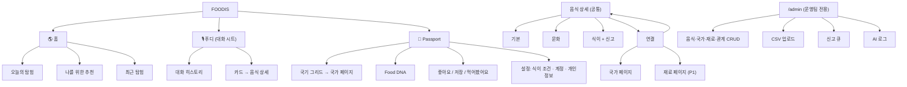
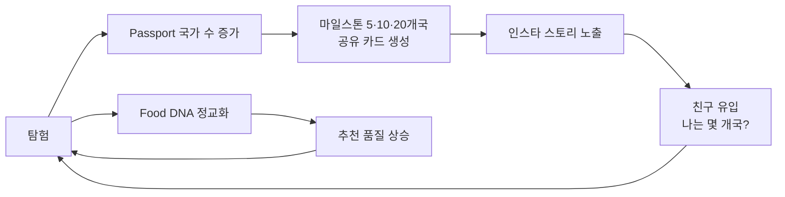

# 📐 07 PRD 보강 — 플랫폼 구조 · KPI · 기능 명세 · API · 수익 모델

> 📐 01~06이 **"무엇을 왜 만드는가"**라면, 07은 개발·디자인팀이 바로 쓸 수 있는 **PRD(제품 요구사항 문서) 형식의 명세**다. 플랫폼 유형, 네트워크 효과, 거버넌스, 기능 ID, API, KPI, 수익 모델처럼 앞선 문서에 빠져 있던 부분을 채운다.

## 1. Executive Summary

| 항목 | 내용 |
|---|---|
| Problem | 음식 서비스는 맛집·레시피·배달 중심이라 세계 음식 문화를 **연결된 구조로 탐험할 곳이 없다**. 식이 조건 사용자는 **신뢰할 수 있는 식이 정보**를 매번 따로 찾아야 한다. 범용 AI는 근거 없는 답을 한다. |
| Solution | 검수된 음식·문화 지식 DB + 사용자 탐험 데이터 + 음성 AI(푸디). AI는 DB 후보 안에서 고르고 설명하며, 서버가 결과를 검증한다. |
| Value Prop | 사용자: "묻기만 하면 나에게 맞는 새로운 나라를 만난다" / 식이 조건 사용자: "먹을 수 있는지 정직하게 알려준다" |
| MVP 범위 | 02 문서 기준 6개 기능 + **콘텐츠 검수 어드민(신규 추가, §4 참고)** |

### 목표 지표 (KPI)

경진대회 시점(시연·베타 테스트 20~30명)과 출시 이후를 나눠 설정한다. 경진대회에서는 **베타 테스트 수치를 발표 슬라이드 1장**으로 보여준다(완성도 점수 근거).

| 구분 | 지표 | 정의 | 경진대회 목표 | 출시 후 목표 |
|---|---|---|---|---|
| North Star | **주간 신규 탐험 국가 수 / 활성 사용자** | 한 주에 사용자가 새로 탐험한 국가 수 평균 | 베타 기간 평균 3개국 이상 | 주 1.5개국 이상 |
| Engagement | 탐험 깊이 (Hops) | 한 세션에서 상세→연결→상세로 이동한 횟수 | 평균 3 이상 | 평균 4 이상 |
| Engagement | 음성 사용률 | 전체 질의 중 음성 질의 비율 | 60% 이상 | 40% 이상 |
| Quality | 추천 수락률 | 추천 카드 중 상세 진입 또는 좋아요로 이어진 비율 | 50% 이상 | 35% 이상 |
| Trust | **사실 오류율** | 테스트 셋에서 DB와 다른 사실(국가·식이·재료)을 말한 응답 비율 | **0% (식이) / 3% 이하 (기타)** | 동일 |
| Performance | 음성 응답 지연 p95 | 발화 종료 → 첫 음성 재생 | 3초 이하 | 2초 이하 |
| Retention | D7 Retention | 가입 7일 후 재방문 비율 | 참고용 (베타 표본 작음) | 25% 이상 |

## 2. 플랫폼 유형 정의

| 단계 | 유형 | 참여 주체 | 핵심 자산 |
|---|---|---|---|
| Phase 1 (MVP·경진대회) | **B2C 단면(single-sided) 지식·콘텐츠 플랫폼** | 사용자 ↔ 운영팀(콘텐츠 공급) | 검수된 음식·문화 DB, 관계 그래프 |
| Phase 2 | B2C + **데이터 네트워크 효과** 플랫폼 | 사용자 ↔ 사용자 데이터(집단 취향) | Food DNA 집계, "이걸 좋아한 사람은 이것도" |
| Phase 3 | **양면 시장(2-Sided)** + 커뮤니티 | 탐험자(수요) ↔ 콘텐츠·경험 공급자(관광청·대사관·문화원·식당·셰프) | 검증된 공급자 콘텐츠, 실제 식당 연결, World Table UGC |

**기획 판단:** 경진대회 단계에서 양면 시장을 표방하면 "공급자는 어디 있냐"는 질문에 답할 수 없다. 발표에서는 **Phase 1을 완성품으로, Phase 2~3을 확장 로드맵으로** 제시한다.

## 3. 네트워크 효과 & 거버넌스

### 3.1 네트워크 효과 설계

| 유형 | 메커니즘 | 도입 시점 |
|---|---|---|
| **데이터 네트워크 효과** (개인) | 내가 탐험할수록 Food DNA가 정교해지고 추천이 좋아진다. 04 문서의 '역이용' 구조 | MVP |
| **데이터 네트워크 효과** (집단) | 사용자 전체의 좋아요·탐험 패턴으로 관계 그래프 가중치 보정. 예: 인제라를 좋아한 사용자가 많이 좋아한 음식 → similar 관계 strength 상향 | Phase 2 |
| 교차 네트워크 효과 | 탐험자가 늘면 공급자(관광청·식당)가 콘텐츠를 올릴 동기가 생기고, 콘텐츠가 늘면 탐험 가치가 커진다 | Phase 3 |
| Cold Start 해결 | 공급자 없이도 동작하도록 **운영팀이 직접 시드 데이터 200건**을 구축한다(Single-player mode). 사용자 1명만 있어도 가치가 성립한다 | MVP |

### 3.2 거버넌스 정책

| 영역 | 정책 | 집행 방법 |
|---|---|---|
| 콘텐츠 정확성 | verified=false 데이터는 추천 후보에서 제외. 식이 정보는 출처 2개가 일치할 때만 yes/no, 그 외에는 depends/unknown | DB 제약 + 어드민 검수 플로우 (F-ADM) |
| 식이 정보 책임 고지 | "FOODIS의 식이 정보는 일반적인 조리법 기준이며, 실제 식당마다 다를 수 있습니다. 알레르기가 있다면 반드시 확인하세요"를 식이 섹션과 온보딩에 표시 | UI 고정 문구 |
| 문화 존중 | 국가·음식 간 우열 표현, 고정관념, 기원 논쟁의 단정 금지. 여러 설이 있으면 "여러 설"로 표기 | 콘텐츠 작성 가이드 + 시스템 프롬프트 금지 규칙 |
| 오류 신고 | 상세 화면 "정보가 틀렸어요" → reports 테이블 → 어드민 큐. 신고 3건 누적 시 해당 필드를 unknown으로 자동 강등 | F-ADM-03 |
| 개인정보 | 식이 프로필은 종교·건강을 **추론할 수 있는 민감 정보**로 취급한다. 추천 필터 외 사용 금지, 분석·외부 제공 금지, 탈퇴 시 즉시 삭제 | Supabase RLS(본인만 접근), 개인정보 처리방침 |
| UGC (Phase 3) | World Table 게시물 사전 필터(LLM moderation) + 신고 기반 사후 조치. 공급자 콘텐츠는 인증 배지 + 운영팀 승인 후 노출 | 확장 시 설계 |

## 4. 기능 명세 (Feature Specifications)

기능 ID는 개발 티켓·커밋 메시지·테스트 케이스에서 공통으로 쓴다. P0 = MVP 필수 / P1 = MVP 여유 시 / P2 = 확장.

| ID | 기능 그룹 | 기능명 | 설명 / 수용 기준 | 우선순위 |
|---|---|---|---|---|
| F-AUTH-01 | 회원/인증 | 소셜 로그인 | Supabase Auth, Google·Kakao OAuth 2.0. 로그인 없이 둘러보기 가능하며, 기록·개인화는 로그인 후 사용 | P0 |
| F-AUTH-02 | 회원/인증 | 게스트 → 회원 전환 | 게스트 상태에서 쌓은 탐험 기록(로컬)을 가입 시 계정으로 병합 | P1 |
| F-ONB-01 | 온보딩 | 인트로 연출 | 국기 → FOOD 애니메이션 3.2초 이내, 건너뛰기 가능, 첫 실행에만 표시 (05 문서) | P1 |
| F-ONB-02 | 온보딩 | 식이·취향 설정 | 식이 조건 8종 다중 선택 + 맛 태그 3개 선택. 모두 건너뛰기 가능. 마이크 권한 요청도 이 단계에서 | P0 |
| F-VOI-01 | 음성 AI | 음성 질의 | 탭 또는 홀드로 녹음 → STT → 인식 텍스트 표시·수정 가능. Web Speech 실패 시 Whisper로 자동 전환 | P0 |
| F-VOI-02 | 음성 AI | 음성 응답 | TTS 재생 + 자막 + 카드 1~3개 + 추천 질문 칩 2~3개. 첫 음성 p95 3초 이하 | P0 |
| F-VOI-03 | 음성 AI | 텍스트 질의 | 음성을 쓸 수 없는 환경을 위한 키보드 입력. 같은 파이프라인 사용 | P0 |
| F-VOI-04 | 음성 AI | 맥락 대화 | 직전 카드의 food_id를 맥락으로 전달. "이거 어느 나라 음식이야?", "비슷한 거 있어?" 처리 | P0 |
| F-VOI-05 | 음성 AI | Food Culture Radio | culture_story 인텐트에서 60초 분량 이야기를 재생하고 "이어서 듣기"로 연결 | P1 |
| F-EXP-01 | 탐험 | 음식 상세 | 기본/문화/식이/연결 4개 탭. 모든 탭 하단에 다음 탐험 링크 1개 이상 | P0 |
| F-EXP-02 | 탐험 | 연결 탐색 | relation_type별 행(같은 재료/비슷한 음식/같은 나라/역사적 연결). 행마다 카드 최대 5개 | P0 |
| F-EXP-03 | 탐험 | 국가 페이지 | 식문화 개요 + 대표 음식 목록. Passport·상세에서 진입 | P0 |
| F-EXP-04 | 탐험 | 재료 페이지 (Ingredient Explorer) | 재료 칩 탭 → 해당 재료를 쓰는 음식 목록(국가별) | P1 |
| F-EXP-05 | 탐험 | World Food Map | SVG 세계 지도에서 국가 탭 → 국가 페이지 | P2 |
| F-PER-01 | 개인화 | 식이 하드 필터 | 추천·목록에서 식이 조건상 'no'인 음식 제외. 'depends'는 ⚠️ 표시와 함께 노출 | P0 |
| F-PER-02 | 개인화 | Food DNA v1 | 좋아요(+1.0)·먹어봤어요(+0.6)·탐험(+0.2) 가중 합으로 taste_tags 벡터를 만들고 0~1로 정규화. 레이더 차트와 한 줄 요약으로 표시 | P0 |
| F-PER-03 | 개인화 | 홈 추천 피드 | 오늘의 탐험 1개(전체 공통, 날짜 시드) + 나를 위한 추천 3개(개인화) | P0 |
| F-REC-01 | 기록 | Food Passport | 탐험 국가·음식 수, 국기 그리드, 대륙별 진행률 | P0 |
| F-REC-02 | 기록 | 음식 액션 | 탐험(자동)/먹어봤어요/좋아요/저장. 토글 가능 | P0 |
| F-REC-03 | 기록 | Passport 공유 카드 | "나는 12개국을 탐험했어요" 이미지 생성 → 인스타 스토리 공유. **성장 루프 핵심** (§7) | P1 |
| F-REC-04 | 기록 | My Table 시각화 | 탐험한 음식이 가상 식탁 일러스트에 쌓이는 화면 | P2 |
| F-ADM-01 | **콘텐츠 운영 (신규)** | 데이터 입력·검수 어드민 | 음식·국가·재료·관계 CRUD, 필드별 출처 입력, verified 토글. 검수자와 작성자를 분리해 기록 | P0 |
| F-ADM-02 | 콘텐츠 운영 | CSV 일괄 업로드 + 임베딩 재생성 | LLM 초안 CSV import → verified=false로 저장 → 검수 후 임베딩 배치 실행 | P0 |
| F-ADM-03 | 콘텐츠 운영 | 오류 신고 큐 | 사용자 신고 목록, 처리 상태 관리, 3건 누적 시 자동 강등 | P1 |
| F-ADM-04 | 콘텐츠 운영 | AI 응답 로그 뷰어 | conversations 조회 + 검증 실패 건 필터. 할루시네이션 테스트·발표 근거용 | P1 |
| F-SOC-01 | 커뮤니티 | World Table | 사용자 음식 경험 공유 피드 | P2 |
| F-VIS-01 | 비전 | Food Image Recognition | 사진 → Vision LLM이 후보 3개 제시 → DB 매칭된 것만 카드로 표시 | P2 |

> ⚠️ **01~06에 없던 신규 항목: 콘텐츠 검수 어드민(F-ADM).** "DB가 사실의 기준"이라는 원칙은 검수 도구가 있어야 실제로 지켜진다. 발표에서도 검수 화면 캡처 1장이 신뢰성 주장의 증거가 된다. 로드맵 DB에 작업으로 추가했다.

## 5. 정보 구조 (IA) & User Journey

### 5.1 메뉴 구조도



### 5.2 User Journey Map (탐험가 민준 기준)

| 단계 | 인지 | 첫 사용 | 핵심 가치 경험 (Aha) | 습관화 | 확산 |
|---|---|---|---|---|---|
| 행동 | 친구의 Passport 공유 카드를 봄 | 인트로 → 취향 3개 선택 → 🎙 첫 질문 | 좋아하는 맛과 연결된, 처음 들어보는 나라 음식을 추천받음 | 오늘의 탐험 듣기, 밖에서 본 음식 물어보기 | 10개국 달성 후 공유 카드 게시 |
| 터치포인트 | F-REC-03 | F-ONB-01·02, F-VOI-01 | F-VOI-02, F-PER-01·02, F-EXP-01 | F-PER-03, F-VOI-05 | F-REC-01·03 |
| 이탈 위험 | — | 마이크 권한 거부, 인트로가 지루함 | 추천이 이미 아는 음식이면 실망 | 새 콘텐츠 고갈 | — |
| 대응 | — | 텍스트 입력 상시 노출, 인트로 skip | unexplored 가산점, "이미 알아요" 버튼 → 즉시 다른 추천 | 데이터 지속 확장(월 30건), 관계 기반 재발견 | — |

## 6. 데이터 모델 & API

### 6.1 Entity 관계 (04 문서 스키마 요약 + 신규 테이블)

```mermaid
erDiagram
    countries ||--o{ foods : has
    foods ||--o{ food_ingredients : uses
    ingredients ||--o{ food_ingredients : in
    foods ||--o{ food_relations : from
    foods ||--o{ food_relations : to
    foods ||--o{ sources : cited_by
    foods ||--|| food_embeddings : embedded
    users ||--|| profiles : has
    users ||--|| dietary_profiles : sets
    users ||--|| food_dna : owns
    users ||--o{ passport_entries : records
    foods ||--o{ passport_entries : recorded_in
    users ||--o{ conversations : talks
    users ||--o{ reports : files
    foods ||--o{ reports : about
    users ||--o{ admin_roles : granted
```
**신규 테이블**

- `reports (id, user_id, food_id, field, message, status: open|resolved|rejected, created_at)`
- `admin_roles (user_id, role: editor|reviewer|admin)` — 작성자와 검수자 분리
- `foods` 컬럼 추가: `created_by`, `verified_by`, `verified_at`

### 6.2 API Endpoints (REST, Next.js Route Handlers)

| Method | Endpoint | 설명 | 인증 | 기능 ID |
|---|---|---|---|---|
| POST | `/api/foodi/ask` | 질의 처리. body: `{text, context_food_id?, input_mode: voice\|text}` → `{speech, cards[], follow_ups[], sources[], conversation_id}` | 선택 (게스트 허용) | F-VOI-01~04 |
| POST | `/api/foodi/tts` | speech 텍스트 → 오디오 스트림 (audio/mpeg) | 선택 | F-VOI-02 |
| POST | `/api/foodi/stt` | 오디오 업로드 → Whisper 텍스트 (fallback 전용) | 선택 | F-VOI-01 |
| GET | `/api/foods/:slug` | 음식 상세 + 재료 + 식이 + 출처 | 공개 | F-EXP-01 |
| GET | `/api/foods/:slug/relations?type=` | 관계 목록 (relation_type 필터) | 공개 | F-EXP-02 |
| GET | `/api/countries/:code` | 국가 개요 + 대표 음식 | 공개 | F-EXP-03 |
| GET | `/api/ingredients/:id/foods` | 재료를 쓰는 음식 목록 | 공개 | F-EXP-04 |
| GET | `/api/feed/home` | 오늘의 탐험 + 개인화 추천 3 + 최근 탐험 | 선택 | F-PER-03 |
| GET / PUT | `/api/me/dietary` | 식이 프로필 조회·수정 | 필수 | F-ONB-02, F-PER-01 |
| GET | `/api/me/passport` | 통계 + 국가별 항목 + Food DNA | 필수 | F-REC-01, F-PER-02 |
| POST / DELETE | `/api/me/passport/:food_id` | body `{status: explored\|tried\|liked\|saved}`. 저장 후 food_dna 재계산 트리거 | 필수 | F-REC-02 |
| GET | `/api/me/passport/share-card` | 공유용 PNG 생성 (OG Image) | 필수 | F-REC-03 |
| POST | `/api/reports` | 정보 오류 신고 | 필수 | F-ADM-03 |
| CRUD | `/api/admin/foods`, `/countries`, `/ingredients`, `/relations` | 콘텐츠 관리 | admin_roles | F-ADM-01 |
| POST | `/api/admin/import`, `/api/admin/embeddings/rebuild` | CSV 일괄 업로드, 임베딩 재생성 | admin | F-ADM-02 |
| GET | `/api/admin/conversations?failed=true` | AI 응답 로그 / 검증 실패 건 | admin | F-ADM-04 |

### 6.3 `/api/foodi/ask` 응답 스키마

```json
{
  "conversation_id": "uuid",
  "intent": "recommend | explain_food | culture_story | filter_by_diet | compare_similar | passport_status | out_of_scope",
  "speech": "오늘은 에티오피아의 인제라를 추천할게요. ...",
  "cards": [
    {
      "food_id": "uuid",
      "slug": "injera",
      "name_ko": "인제라",
      "country": { "code": "ET", "flag": "🇪🇹", "accent": "#2E7D32" },
      "summary": "테프를 발효시켜 만든 시큼한 빵",
      "diet_badges": [ { "key": "vegan", "level": "yes" }, { "key": "gluten_free", "level": "depends" } ],
      "reason": "발효 · 곡물 태그 선호"
    }
  ],
  "follow_ups": ["문화 이야기 들려줘", "비슷한 음식", "다른 거 추천"],
  "sources": [ { "food_id": "uuid", "title": "...", "url": "..." } ],
  "validated": true
}
```
`diet_badges`는 LLM 출력이 아니라 서버가 DB에서 채운다. `validated=false`면 템플릿 응답으로 대체된 것이며, 이 경우 F-ADM-04 로그에 남는다.

## 7. 성장 모델 (Growth)

### 7.1 성장 루프


- **바이럴 루프:** Passport 공유 카드. 국가 수는 비교하기 쉽고 자랑할 만한 숫자다.
- **개인화 루프:** 쓸수록 추천이 좋아져 재방문 동기가 생긴다.
- **콘텐츠 루프 (Phase 3):** 사용자가 늘면 공급자가 콘텐츠를 올리고, 탐험 가능한 범위가 넓어진다.

### 7.2 초기 Go-to-Market

| 채널 | 대상 | 실행 |
|---|---|---|
| 교내 | 성공회대 재학생·유학생 | 경진대회 전 베타 20~30명 모집 → KPI 실측 → 발표 근거로 사용 |
| 유학생 커뮤니티 | 식이 조건이 있는 유학생(할랄·비건) | "한국에서 먹을 수 있는 세계 음식" 콘텐츠로 시나리오 B 검증 |
| SNS | 20대 탐험형 사용자 | 공유 카드, "오늘의 탐험" 숏폼 |

## 8. 수익 모델 (Monetization)

경진대회 평가 항목에는 없지만, Q&A에서 "지속 가능성" 질문이 나올 때를 대비한다. **발표에서는 슬라이드 1장 이하**로 다룬다.

| 단계 | 모델 | 구조 | 검증 지표 |
|---|---|---|---|
| Phase 1 | 무료 | 사용자 확보와 데이터 축적에 집중 | MAU, D7 Retention |
| Phase 2 | **B2G/B2B 콘텐츠 제휴** | 관광청·대사관·문화원이 공식 국가 음식 콘텐츠를 스폰서로 제공 ("이달의 국가" 기획전). 콘텐츠에 스폰서임을 명시 | 제휴 수, 스폰서 국가의 탐험 증가율 |
| Phase 2 | 프리미엄 구독 | Food Culture Radio 전체 에피소드, 상세 식이 리포트, 오프라인 저장. 월 2,900~4,900원 범위에서 테스트 | Conversion Rate, Churn |
| Phase 3 | **식당·경험 연결 수수료** | "이 음식, 근처에서 먹어보기"로 검증된 식당(식이 정보 인증)을 연결. 예약·쿠폰 기준 수수료(Take Rate) | GMV, Take Rate, 식당당 전환 |
| Phase 3 | 데이터 API (B2B) | 검수된 세계 음식·식이 데이터셋을 여행·급식·식품 기업에 API로 제공. 개인 데이터는 제외하고 콘텐츠 DB만 제공 | API 계약 수, ARR |

**단위 경제성 (출시 후 추적):** LTV(구독 ARPU × 평균 유지 개월 + 수수료 기여) / CAC(공유 카드 바이럴로 유료 획득 비중 최소화). 목표 LTV:CAC 3:1 이상.
**원칙:** 광고와 스폰서 콘텐츠는 추천 알고리즘에 영향을 주지 않는다. 스폰서 콘텐츠는 별도 섹션에 "제휴" 라벨을 붙여 노출한다. 추천의 신뢰가 서비스의 핵심 자산이기 때문이다.

## 9. 비기능 요구사항

| 항목 | 요구사항 |
|---|---|
| 성능 | 첫 음성 p95 3초 이하, 상세 화면 LCP 2.5초 이하 (4G 환경) |
| 호환성 | iOS Safari 16+, Android Chrome 최신 2개 버전. 360px 너비부터 지원 |
| 보안 | 모든 사용자 테이블에 Supabase RLS 적용, LLM·TTS API 키는 서버에서만 사용, /admin은 role 검증 |
| 비용 | 질의 1건당 LLM 2회 호출(의도 분석 + 생성) + TTS 1회. 데모 응답 캐시로 반복 호출 비용 절감. 경진대회 기간 API 예산 상한 설정 |
| 접근성 | 모든 음성 응답에 자막 제공, 색상만으로 식이 상태를 구분하지 않음(아이콘 + 라벨 병기) |
