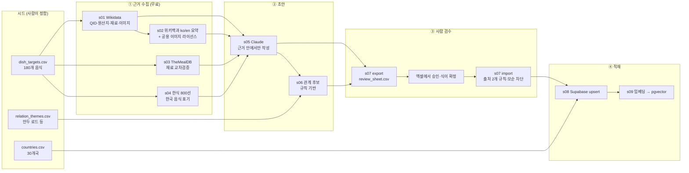

# 🗄️ 10 데이터 수집 파이프라인 (DB 구축 키트)

> 🗄️ 바탕화면 `Foodis/foodis-data` 폴더에 바로 실행할 수 있는 **DB 구축 키트**를 넣었다. 스키마(SQL), 시드 데이터(30개국·180개 음식·관계 테마), 수집→초안→검수→적재→임베딩 스크립트 9개, 오프라인 테스트까지 포함.
>
> 원칙은 04·07 문서와 같다: **DB가 사실의 기준, AI는 근거 안에서만 초안, 식이 정보는 사람이 확정.**

## 1. 흐름



## 2. 키트 구성

```
Foodis/foodis-data/
├─ (스키마는 루트 supabase/migrations/0001_init.sql 로 이동)  전체 스키마 + RLS + match_foods RPC + 신고 자동 강등 트리거
├─ data/seed/
│   ├─ countries.csv          30개국 (ISO 코드, 국기, 대륙 그룹, Accent 컬러)
│   ├─ dish_targets.csv       180개 음식 (위키백과 제목 힌트, 기원 메모, 데모 필수 16개)
│   └─ relation_themes.csv    만두 로드 · 커피 하우스 · 필라프 · 꼬치 구이 등 10개 테마
├─ scripts/ s01 ~ s09 + common.py
├─ tests/   가짜 HTTP로 s01→s09 전 구간 E2E 테스트
├─ .env.example · requirements.txt · README.md
```

### 시드 데이터 구성

| 대륙 그룹 | 국가 (각 6개 음식) |
|---|---|
| 아시아 10 | 🇰🇷 한국 · 🇯🇵 일본 · 🇨🇳 중국 · 🇹🇭 태국 · 🇻🇳 베트남 · 🇮🇩 인도네시아 · 🇵🇭 필리핀 · 🇮🇳 인도 · 🇳🇵 네팔 · 🇺🇿 우즈베키스탄 |
| 유럽 7 | 🇮🇹 이탈리아 · 🇫🇷 프랑스 · 🇪🇸 스페인 · 🇬🇷 그리스 · 🇦🇹 오스트리아 · 🇵🇱 폴란드 · 🇬🇪 조지아 |
| 중동·아프리카 7 | 🇹🇷 튀르키예 · 🇱🇧 레바논 · 🇮🇷 이란 · 🇪🇬 이집트 · 🇲🇦 모로코 · 🇪🇹 에티오피아 · 🇿🇦 남아공 |
| 아메리카 6 | 🇲🇽 멕시코 · 🇺🇸 미국 · 🇵🇪 페루 · 🇧🇴 볼리비아 · 🇧🇷 브라질 · 🇦🇷 아르헨티나 |

- 데모 스크립트(03 문서)에 나오는 음식 16개는 `demo_required=Y`로 표시돼 검수 시트 맨 위에 온다 (김치·만두·자오즸·모모·만티·피에로기·힌칼리·인제라·차나 마살라·팔락 파니르·버터 치킨·팔라펠·튀르키예 커피·비엔나 커피·세비체·살테냐).
- 기원 논쟁이 있는 음식(팔라펠·바클라바·후무스 등)은 `origin_note`에 "여러 설"을 적어 두고, Wikidata 원산지와 다르면 검수 경고가 뜬다.

## 3. 스크립트별 역할

| 단계 | 스크립트 | 하는 일 | 필요한 키 | 안전장치 |
|---|---|---|---|---|
| ① | `s01_wikidata.py` | 위키백과 제목 50개씩 → QID(리다이렉트 추적) → SPARQL 40개씩으로 원산지·재료·이미지 | 없음 | 제목 실패 시 검색 1위로 대체 + `needs_review`. 원산지 불일치 경고 |
| ① | `s02_wikipedia.py` | ko/en 요약 + 공용 이미지 작가·라이선스 | 없음 | 동음이의어 문서 제외 |
| ① | `s03_themealdb.py` | (선택) 같은 음식의 재료 목록 → 교차검증 근거 | 없음 (테스트 키) | 본문·이미지 저장 안 함 |
| ① | `s04_hansik800.py` | (선택) 한국 음식 6개의 영문 표기·설명 표준 | 없음 (XLSX) | 열 이름이 바뀌어도 키워드로 자동 감지 |
| ② | `s05_llm_draft.py` | 근거 묶음을 Claude에 넘겨 요약·역사·문화 이야기·맛 태그·재료·식이 초안 작성 | ANTHROPIC | tool_use로 JSON 스키마 강제, 근거 없으면 null, 건별 저장(중단 후 이어하기) |
| ② | `s06_relations.py` | 관계 후보: 같은 특징적 재료 / 같은 조리법 / 맛 태그 유사 / 테마(만두 로드 등) | 없음 | 흔한 재료(밀가루·양파)는 근거에서 제외, 음식당 유형별 상위 4개만 → 검수 가능한 규모 |
| ③ | `s07_review.py export` | 자동 검증 → 검수 시트(CSV). 데모 필수 음식·경고 있는 행이 위로 | 없음 | 재료-식이 모순, 문화 이야기 누락, 원산지 불일치 표시 |
| ③ | `s07_review.py import` | 승인(Y)된 행만 최종본으로. 검수자가 고친 문장 반영 | 없음 | **식이 yes/no는 출처 URL 2개 이상일 때만**, 모순이 남아 있으면 적재 차단 |
| ④ | `s08_load.py` | countries → foods → ingredients → 연결 → sources → relations upsert | SUPABASE (service_role) | `--dry-run`, 재실행해도 중복 없음(upsert) |
| ④ | `s09_embed.py` | 이름·국가·요약·맛·재료·식이·문화를 한국어 문장으로 묶어 임베딩 | OPENAI, SUPABASE | `--dry-run`으로 임베딩 텍스트 미리보기 |

## 4. 검수 규칙 (시트 작성법)

| 열 | 입력 | 규칙 |
|---|---|---|
| `approve` | Y 또는 빈칸 | Y만 서비스에 노출(verified=true) |
| `summary` · `history` · `culture_story` | 직접 수정 가능 | 수정한 문장이 최종본에 반영됨 |
| `final_vegan` … `final_dairy_free` | yes / depends / no / unknown | `draft_*`(AI 초안)을 참고만 하고 사람이 결정 |
| `diet_sources` | URL을 띄어쓰기로 구분 | yes/no는 **2개 이상** 필요. 부족하면 자동으로 unknown |
| `diet_note` | 문장 | "기(ghee) 쓰는 식당 있음" 같은 주의 사항 → 상세 화면 ⚠️ 설명 |
| `auto_flags` | (자동) | 비어 있지 않으면 반드시 확인. 재료-식이 모순은 import 때 차단됨 |

**권장 분담:** 국가 30개를 팀원 수대로 나눠 검수. 한 사람당 하루 15건이면 4명 기준 3일. 데모 필수 16개는 2명이 교차 검수.

## 5. 검증 결과

- **스키마:** Postgres 파서로 54개 문장 문법 검사 통과. pgvector·pg_trgm을 넣은 임베디드 Postgres(PGlite)에서 실제로 실행해 모든 테이블·RLS·함수·트리거 생성 확인.
- **match_foods RPC:** 비건 필터 · 미탐험 국가 가산점(+0.3) · 취향 태그 점수가 의도대로 동작. 불고기(vegan=no)는 비건 요청에서 제외됨.
- **신고 트리거:** 같은 식이 필드 신고 3건 → 해당 값이 unknown으로 자동 강등.
- **파이프라인 E2E 테스트:** 가짜 HTTP로 s01→s09 전 구간 실제 실행 통과. 검수 규칙을 다음과 같이 확인했다: 출처 0~1개인 yes → unknown 강등 / 출처 2개여도 "동물성 재료인데 vegan=yes" → 차단 / 돼지고기 포함인데 halal≠no → 차단 / 만두↔피에로기 테마 관계 생성 / 밀가루 같은 흔한 재료로는 관계 안 만듦.
- **적재 페이로드:** s08이 만든 데이터를 실제 스키마에 넣어 열 이름·타입·제약조건 모두 통과.

> ⚠️ 실제 외부 서버(위키백과·Wikidata 등) 호출은 아직 하지 않았다. 클라우드 작업 환경에서는 해당 도메인이 막혀 있어, s01·s02는 내 컴퓨터에서 첫 실행하면 된다 (키 불필요, 약 5분). 제목 힌트가 틀린 음식은 실행 결과에 목록으로 나온다.

## 6. 실행 순서

```bash
cd Foodis/foodis-data
pip install -r requirements.txt
cp .env.example .env              # User-Agent에 연락처, 키 입력

# Supabase SQL Editor 에 ../supabase/migrations/0001_init.sql 실행

python scripts/s01_wikidata.py
python scripts/s02_wikipedia.py
python scripts/s03_themealdb.py     # 선택
python scripts/s04_hansik800.py     # 선택, data/raw/hansik800.xlsx 필요
python scripts/s05_llm_draft.py
python scripts/s06_relations.py
python scripts/s07_review.py export # → 엑셀 검수
python scripts/s07_review.py import
python scripts/s08_load.py --dry-run && python scripts/s08_load.py
python scripts/s09_embed.py

python -m pytest tests -q            # 언제든 오프라인 검증
```

## 7. 일정 (P2 데이터 단계)

| 일차 | 작업 | 산출물 |
|---|---|---|
| D1 | 키 발급, Supabase 프로젝트 + 마이그레이션, s01·s02 실행, 제목 힌트 수정 | raw/wikidata.json, wikipedia.json |
| D2 | s03·s04, s05 데모 필수 16개만 먼저 실행 → 품질 확인 → 프롬프트 조정 | 초안 16건 |
| D3 | s05 전체 180건, s06 관계 후보 | foods_draft.json, relations_review.csv |
| D4~D7 | 검수 (데모 16개 교차 검수 우선) | review_sheet.csv 완료 |
| D8 | s07 import → s08 → s09, 관계 300건 이상 확인 | Supabase 적재 완료 |
