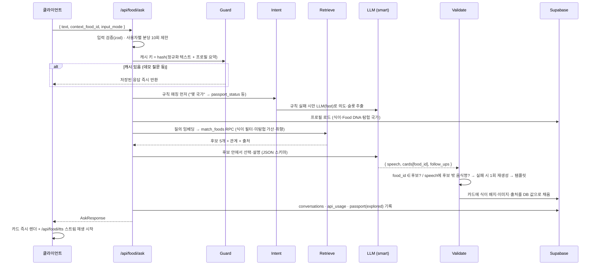

# 🏗️ 11 상세 아키텍처 · 설계 도안

> 🏗️ 04 문서의 개념 아키텍처를 **실제 구현 단위**로 내린 설계도다. 핵심은 세 가지: ① 외부 API는 전부 **어댑터 뒤에** 두어 바꿔 끼울 수 있게 한다 ② **런타임(앱)과 배치(데이터 구축)를 분리**한다 ③ 모든 외부 호출에 **캐시·대체 경로·비용 상한**을 둔다. 데모 현장에서 어느 외부 서비스가 죽어도 핵심 루프는 돌아야 한다.

## 1. 전체 구조

```mermaid
flowchart TB
    subgraph CLIENT["클라이언트 — Next.js 15 PWA"]
        UI["화면<br>홈 · 푸디 시트 · 상세 · Passport"]
        VOICE["Voice 모듈<br>Web Speech STT · 오디오 플레이어"]
        SW["Service Worker<br>정적 자산 · 데모 오프라인 캐시"]
    end
    subgraph SERVER["서버 — Next.js Route Handlers (Vercel)"]
        API["/api/* BFF<br>인증 · 입력 검증 · 속도 제한"]
        ORCH["Foodi Orchestrator<br>intent → retrieve → generate → validate"]
        GUARD["Budget · Cache Guard<br>일일 예산 · 응답 캐시"]
        subgraph ADAPTERS["Provider 어댑터 (환경변수로 교체)"]
            P1["LLM<br>Claude Haiku / Sonnet"]
            P2["Embedding<br>OpenAI 3-small"]
            P3["STT<br>GPT Transcribe"]
            P4["TTS<br>Google / OpenAI"]
            P5["Places<br>Kakao (Phase 3)"]
            P6["Vision<br>Claude (확장)"]
        end
    end
    subgraph DATA["Supabase"]
        PG[("Postgres<br>FOOD DB · USER DB")]
        VEC[("pgvector<br>food_embeddings")]
        RPC["match_foods RPC"]
        ST[("Storage<br>TTS mp3 캐시")]
        AUTH["Auth<br>Google · Kakao OAuth"]
    end
    subgraph BATCH["배치 — foodis-data (로컬/수동 실행)"]
        PIPE["s01~s09<br>수집 → 초안 → 검수 → 적재 → 임베딩"]
    end
    UI --> API
    VOICE --> API
    API --> ORCH --> GUARD --> ADAPTERS
    ORCH --> RPC --> PG & VEC
    API --> PG
    P4 --> ST
    UI --> AUTH
    PIPE --> PG & VEC
```



### 런타임 vs 배치

| 구분 | 런타임 (앱) | 배치 (foodis-data) |
|---|---|---|
| 언어 | TypeScript (Next.js) | Python |
| 쓰는 외부 API | LLM, 임베딩(질의), STT, TTS, (Places) | Wikidata, 위키백과, 공용, TheMealDB, LLM(초안), 임베딩(음식) |
| DB 권한 | anon 키 + RLS (사용자 데이터) / 서버 라우트만 service_role | service_role (읽기·쓰기) |
| 실패 시 | 즉시 대체 경로 (§6) | 재실행 (캐시·건별 저장으로 이어하기) |

**왜 분리하나:** 위키백과·Wikidata는 앱이 실시간으로 부르지 않는다. 사실은 검수를 거쳐 DB에 들어간 것만 쓴다. 그래서 앱 응답이 외부 지식 사이트 상태에 따라 흔들리지 않고, "AI가 사실을 만들지 않는다"는 주장이 구조적으로 보장된다.

## 2. 폴더 구조 (모노레포)

```
foodis/
├─ apps/web/                          Next.js 15 (App Router, PWA)
│  ├─ app/
│  │  ├─ (intro)/page.tsx              S0 국기 → FOOD 인트로
│  │  ├─ onboarding/page.tsx           S1 식이·취향
│  │  ├─ page.tsx                      S2 홈
│  │  ├─ food/[slug]/page.tsx          S4 상세 (SSG + revalidate)
│  │  ├─ country/[code]/page.tsx
│  │  ├─ passport/page.tsx             S5
│  │  ├─ admin/                        F-ADM 검수 화면
│  │  └─ api/
│  │     ├─ foodi/ask/route.ts         질의 → JSON (텍스트·카드)
│  │     ├─ foodi/tts/route.ts         speech → 오디오 스트림
│  │     ├─ foodi/stt/route.ts         오디오 → 텍스트 (fallback)
│  │     ├─ foods/[slug]/… · me/… · reports · admin/…   (07 문서 API 표)
│  ├─ components/  FoodCard · VoiceButton · DietBadge · FollowUpChip · RelationRow · PassportGrid
│  └─ lib/
│     ├─ foodi/
│     │  ├─ orchestrator.ts            파이프라인 조립
│     │  ├─ intent.ts                  의도 분류 (규칙 우선 → LLM)
│     │  ├─ retrieve.ts                match_foods 호출
│     │  ├─ generate.ts                답변 생성 (JSON 스키마)
│     │  ├─ validate.ts                food_id·식이·음식명 검증
│     │  ├─ prompts/                   시스템 프롬프트 (버전 관리)
│     │  └─ schema.ts                  zod: AskResponse
│     ├─ providers/
│     │  ├─ types.ts                   LLM · Embedder · STT · TTS · Places 인터페이스
│     │  ├─ anthropic.ts · openai.ts · google-tts.ts · kakao.ts
│     │  └─ index.ts                   env → 구현체 선택
│     ├─ guard/  budget.ts · cache.ts · ratelimit.ts
│     └─ db/     supabase-server.ts · supabase-browser.ts · types.gen.ts
├─ foodis-data/                       배치 파이프라인 (현재 폴더에 있음)
└─ supabase/migrations/               스키마 (foodis-data와 공유)
```

## 3. Provider 어댑터 인터페이스

```typescript
// lib/providers/types.ts
export interface LLMProvider {
  // JSON 스키마를 강제한 구조화 출력 (Claude: tool_use 강제 / OpenAI: json_schema)
  structured<T>(req: { system: string; user: string; schema: JSONSchema; model: 'fast' | 'smart'; maxTokens: number }): Promise<{ data: T; usage: Usage }>;
}
export interface Embedder { embed(texts: string[]): Promise<{ vectors: number[][]; usage: Usage }>; }
export interface STTProvider { transcribe(audio: Blob, opts: { lang: 'ko'; keywords?: string[] }): Promise<{ text: string; usage: Usage }>; }
export interface TTSProvider { synthesize(text: string, opts: { voice: string; format: 'mp3' }): Promise<{ stream: ReadableStream; usage: Usage }>; }
export interface PlacesProvider { searchNearby(q: { keyword: string; lat: number; lng: number; radiusM: number }): Promise<Place[]>; }
export type Usage = { provider: string; operation: string; units: number; unitType: 'tokens' | 'seconds' | 'chars' | 'calls'; costUsd: number };

// lib/providers/index.ts — 환경변수로 구현체 선택
export const llm: LLMProvider = process.env.LLM_PROVIDER === 'openai' ? openaiLLM() : anthropicLLM();
export const tts: TTSProvider = process.env.TTS_PROVIDER === 'openai' ? openaiTTS() : googleTTS();
```
- 모든 어댑터는 `Usage`를 돌려주고, Guard가 이를 `api_usage` 테이블에 기록한다 → 비용이 항상 보인다.
- `model: 'fast' | 'smart'` 추상화로 Haiku↔Sonnet, 또는 Claude↔OpenAI 교체가 코드 수정 없이 가능하다.

## 4. 요청 흐름 — `/api/foodi/ask`



### 지연시간 예산 (목표: 발화 종료 → 첫 음성 3초)

| 구간 | 목표 | 줄이는 방법 |
|---|---|---|
| STT 확정 | 0.3초 | Web Speech 중간 결과 표시, 묵음 0.8초에 확정 |
| 의도 분류 | 0.4초 | 규칙 매칭으로 절반 이상 LLM 생략, 필요 시 fast 모델 |
| 검색 | 0.3초 | 질의 임베딩과 프로필 로드를 병렬 처리, HNSW 인덱스 |
| 답변 생성 | 1.5초 | 출력 300토큰 제한, 컨텍스트 음식당 300토큰 |
| TTS 첫 오디오 | 0.5초 | 첫 문장만 먼저 합성·스트리밍, 캐시 히트 시 0초 |

## 5. 캐시 전략

| 대상 | 키 | 저장소 | 수명 | 목적 |
|---|---|---|---|---|
| 질의 응답 | sha256(정규화 텍스트 + 식이 조건 + 탐험 국가 수 구간) | `response_cache` (kind=answer) | 24시간, **데모 질문 10개는 고정** | 데모 안정성 · 비용 |
| TTS 오디오 | sha256(speech 문장 + 목소리) | Supabase Storage mp3 + `response_cache` (kind=tts) | 30일 | 같은 문장 재합성 방지 (문화 이야기 60초는 미리 생성) |
| 음식 상세 | slug | Next.js ISR (정적 생성) | 검수 후 재검증 호출 | 상세 화면 즉시 로딩 |
| 질의 임베딩 | 정규화 텍스트 | 메모리 LRU | 프로세스 수명 | 반복 질문 비용·지연 절감 |
| 근처 식당 (Phase 3) | 키워드 + 좌표 격자 | `response_cache` | **캐시 안 함** — 카카오 로컬은 결과 서버 캐싱·DB 저장 금지(실시간 호출만). DB 트리거로도 차단됨 | 사용자별 속도 제한으로 쿼터 관리 |

## 6. 장애 대체 경로

| 장애 | 감지 | 대체 동작 | 사용자가 보는 것 |
|---|---|---|---|
| Web Speech 인식 실패·미지원 브라우저 | 빈 결과, onerror, API 없음 | 녹음 → `/api/foodi/stt` (GPT Transcribe + 음식명 키워드 힌트) | "한 번 더 들어볼게요" + 텍스트 입력창 |
| LLM 지연·오류 | 4초 타임아웃, 5xx | fast 모델로 1회 재시도 → 실패 시 **템플릿 응답**(후보 1위 음식의 DB summary를 그대로 읽음) | 카드는 정상 표시, 문장만 단순해짐 |
| 검증 실패 (후보 밖 음식 언급) | validate.ts | 1회 재생성 → 템플릿 | 사실 오류 대신 단순한 답 |
| 임베딩 API 오류 | 5xx | 키워드 검색(pg_trgm) + 태그 점수만으로 후보 선정 | 추천 정확도만 약간 하락 |
| TTS 오류 | 5xx, 타임아웃 | 다른 TTS 어댑터 → 브라우저 speechSynthesis | 목소리가 바뀌지만 음성은 나옴, 자막은 항상 표시 |
| Supabase 일시정지·장애 | 연결 실패 | 데모 모드: Service Worker에 미리 저장한 데모 질문 10개 응답·오디오·상세 화면 | 데모 시나리오는 그대로 진행 |
| 일일 API 예산 초과 | api_usage 합계 ≥ DAILY_BUDGET_USD | 캐시 + 템플릿 응답 모드, 관리자 알림 | 서비스는 계속 동작 |

## 7. 보안

- **키 관리:** 모든 외부 API 키와 Supabase service_role은 서버 환경변수에만. 클라이언트는 anon 키 + RLS. 스크립트용 `.env`는 `.gitignore`.
- **RLS:** 사용자 테이블은 본인만, 공개 콘텐츠는 `verified=true`만 읽기. 쓰기는 서버 라우트가 권한 확인 후 service_role로 (마이그레이션에 포함).
- **속도 제한:** `/api/foodi/*` 사용자·IP별 분당 10회, 게스트는 하루 30회. LLM 비용 폭주 방지.
- **프롬프트 주입:** 사용자 발화는 user 메시지에만, DB 근거는 별도 태그 블록. 출력은 스키마 + 검증을 통과해야만 노출되므로 주입이 성공해도 DB 밖 사실은 화면에 나가지 않는다.
- **개인정보:** 식이 프로필은 추천 필터에만 사용. LLM에는 "비건 조건 있음" 수준으로만 전달하고 종교·건강 추론 문구를 만들지 않는다.

## 8. 관측성·비용

- `api_usage`: 호출마다 provider·operation·사용량·비용 기록 → /admin 대시보드에 일별 비용·질의당 비용.
- `conversations`: 의도, 검증 결과, 지연시간 → 할루시네이션 테스트·KPI(07 문서) 측정 근거.
- 발표용 지표: "검증 실패로 템플릿 대체된 비율", "처음 음성까지 p95", "질의당 평균 비용".

## 9. 환경변수

```bash

# 공개 (클라이언트)

NEXT_PUBLIC_SUPABASE_URL=
NEXT_PUBLIC_SUPABASE_ANON_KEY=

# 서버 전용

SUPABASE_SERVICE_ROLE_KEY=
LLM_PROVIDER=anthropic            # anthropic | openai
LLM_MODEL_FAST=                   # 예: Claude Haiku 4.5 모델 ID
LLM_MODEL_SMART=                  # 예: Claude Sonnet 5 모델 ID
ANTHROPIC_API_KEY=
OPENAI_API_KEY=                   # 임베딩 · STT fallback · (TTS 후보)
EMBEDDING_MODEL=text-embedding-3-small
TTS_PROVIDER=google               # google | openai
GOOGLE_TTS_CREDENTIALS_JSON=
KAKAO_REST_API_KEY=               # Phase 3
DAILY_BUDGET_USD=5
DEMO_MODE=false                   # true면 데모 질문 캐시 우선·외부 호출 최소화
```

## 10. 배포·환경

| 환경 | 앱 | DB | 용도 |
|---|---|---|---|
| dev | 로컬 `next dev` | Supabase 프로젝트 A (Free) | 개발·데이터 검수 |
| demo | Vercel | Supabase 프로젝트 B (대회 2주 전 Pro 전환 또는 헬스체크로 일시정지 방지) | 베타 테스트·발표 |

- 마이그레이션은 `supabase/migrations`에서만 변경 → 두 환경에 같은 순서로 적용.
- 데이터는 dev에서 검수 완료 후 `s08_load.py`를 demo 환경 키로 한 번 더 실행.

## 11. 구현 순서 (MVP 4주와 매핑)

| 주 | 아키텍처 작업 |
|---|---|
| W1 | Supabase 마이그레이션, `lib/db`, 상세 화면 ISR, 데이터 키트 s01~s05(데모 16개) |
| W2 | providers/types + anthropic·openai 어댑터, orchestrator(텍스트), validate, api_usage 기록 |
| W3 | Voice 모듈(Web Speech + STT fallback), TTS 어댑터 2종 측정·선택, 캐시·예산 Guard |
| W4 | 데모 모드(Service Worker 캐시), 장애 대체 경로 리허설, 속도 제한, /admin 비용 대시보드 |
